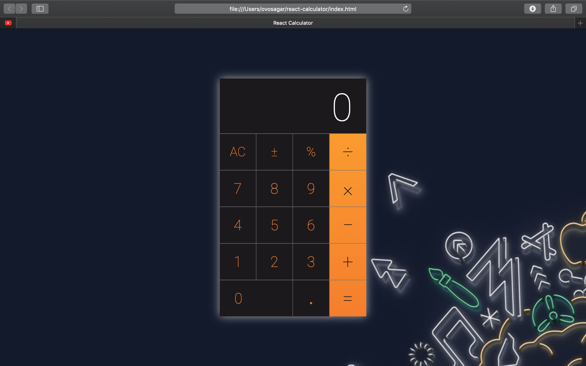

# React.js
This repository holds React.js projects with an emphasis on developing clear and concise user interfaces.
This is a react application developed in a means to create a better Apple IOS calculator.

Run Instructions:

Clone/Download file, Open index.html file in Chrome/Safari browser.

or
    
npm install

npm start 

# PWA Notes App (Node.js)

